# Riverr
A web application made with **MERN Stack** where people can find jobs. (Buggy AF)

## Features
* Two types of users:
	1. Applicants
	2. Recruiters
* Two sections:
	1. Profile - To view and update information about you
	2. Dashboard - To view and apply to jobs (Applicants) and To create new or delete job listings, view and accept/reject applications
* Sends you email if your application gets selected.
* And many more.

## Before Running
```shell
$ cd frontend && npm install && cd ..
$ cd backend && npm install && cd ..
```
## Starting
* Starting the `backend`:
 ```shell
  $ cd backend && node server.js
  ```
* Starting the `frontend`:
 ```shell
  $ cd frontend && npm start
  ```
* Then go to [http://localhost:3000/](http://localhost:3000/) and **Voila!**

## Screenshots

### Home Page
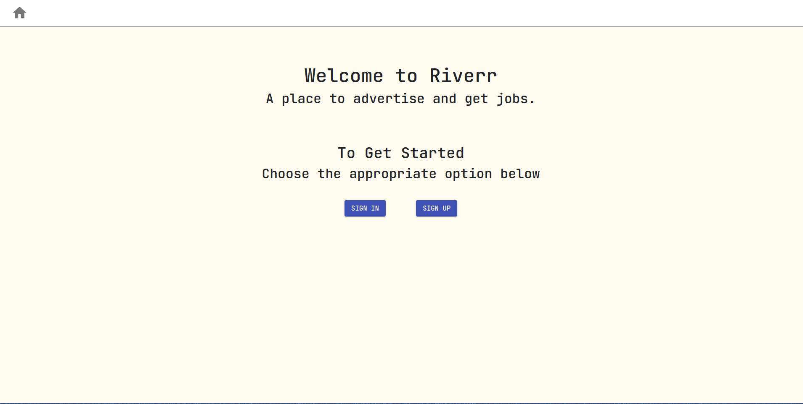

### Register
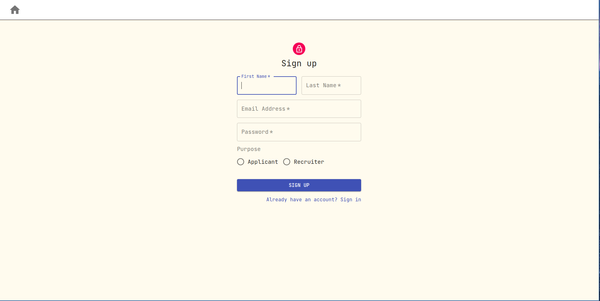

### Login
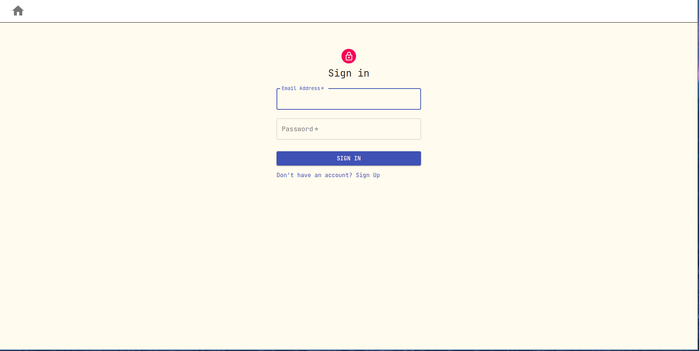

### Profile - Applicant
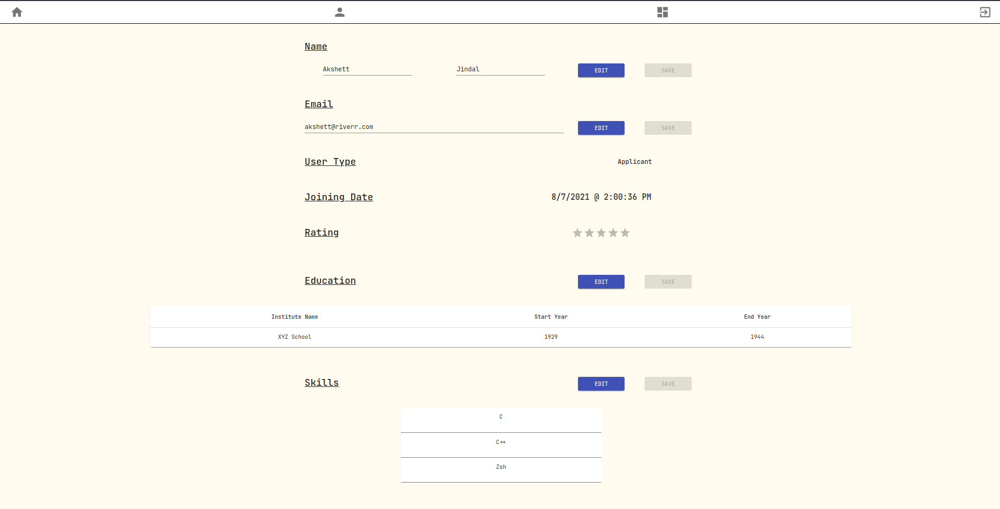

### Profile - Recruiter
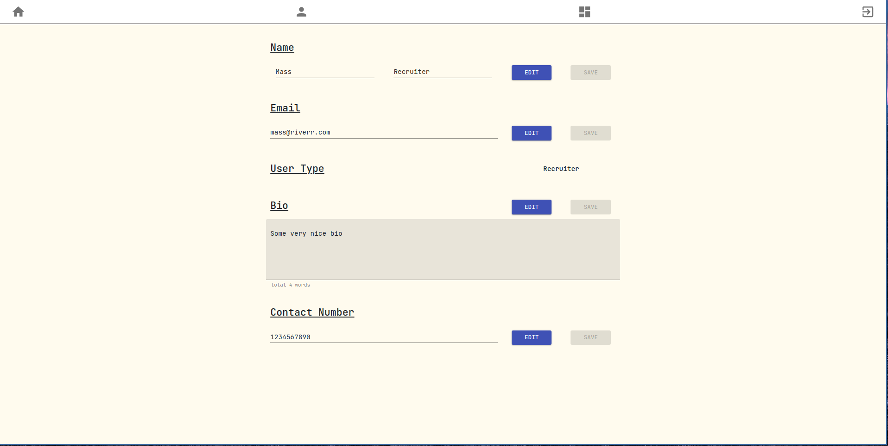

### Recruiter - Create Jobs
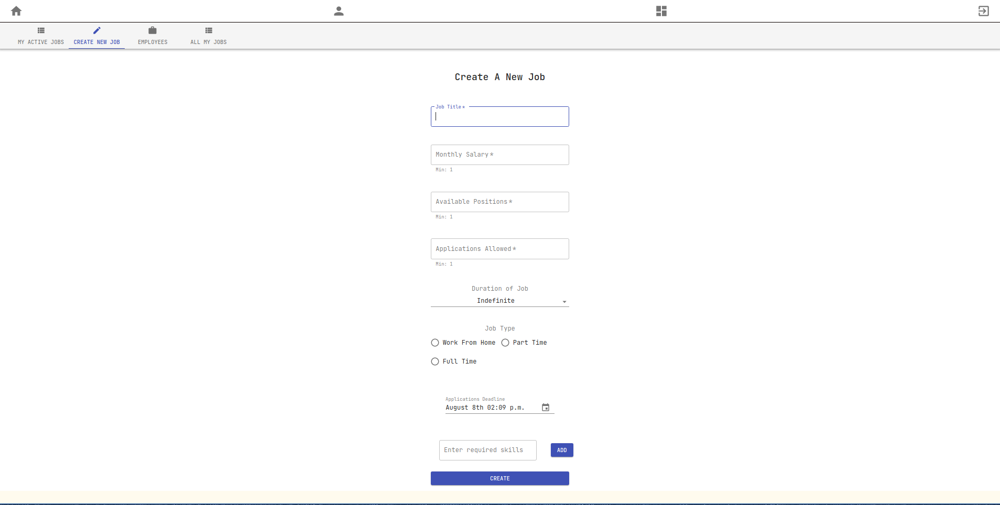

### Recruiter - My Jobs
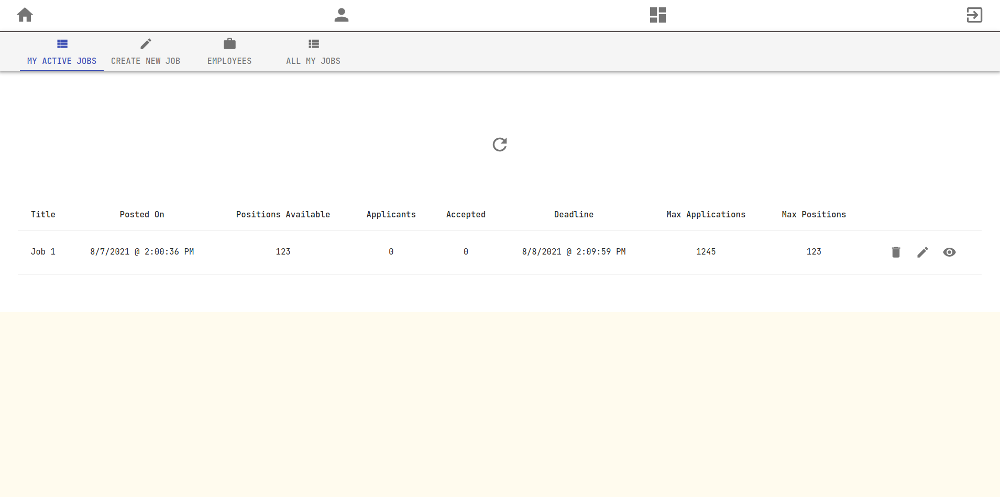

### Recruiter - My Employees
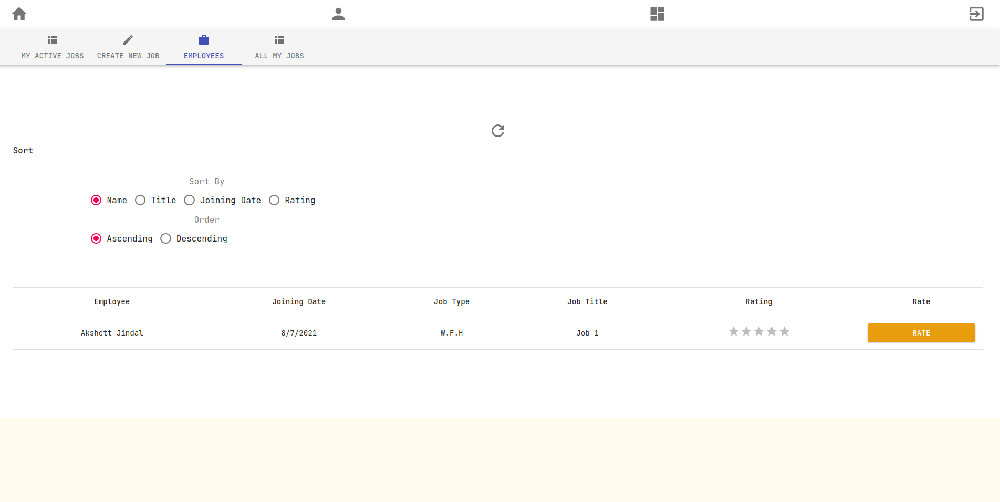

### Recruiter - Open Applications
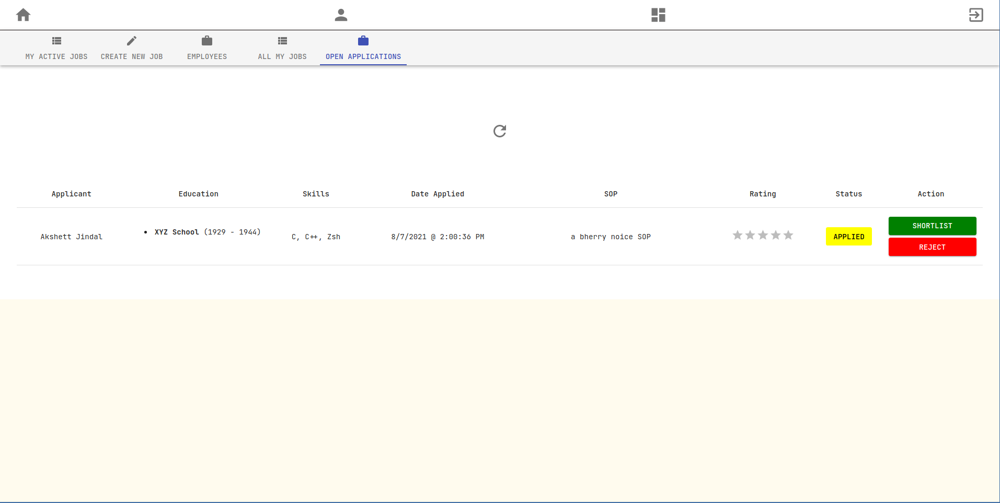

### Applicant - My Applications
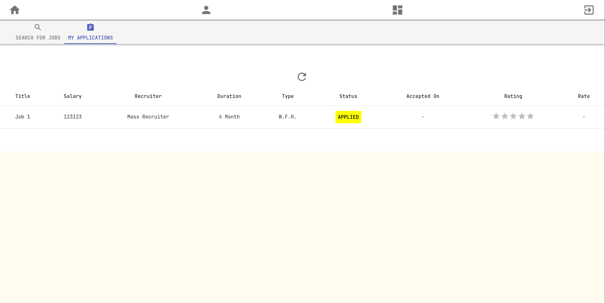

### Applicant - Search For Jobs
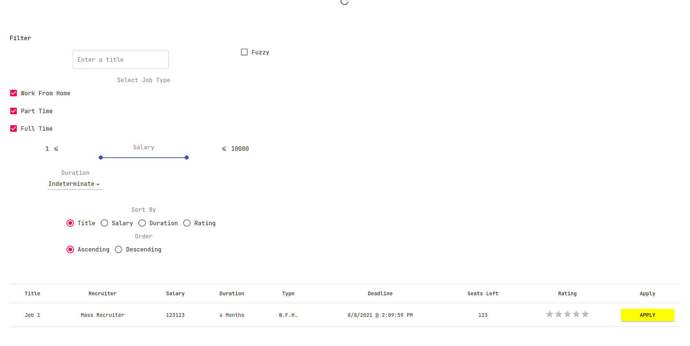
